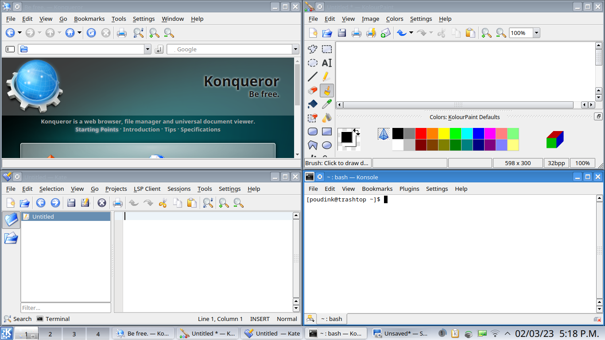

# Plastik Style

A port of the Plastik theme used for KDE3.4 and KDE3.5 to Plasma 5. Also contains a port of the CrystalSVG icon theme used from KDE3.1 to KDE3.5, as well as a remake of Kicker's default look for the Plasma panel.
## TODO
### CrystalSVG
* Get rid of useless remnants from the KDE3 era. There are a tons of these.
* GNOME applications are missing many icons.
* Inkscape is missing many icons.
* Most window actions (minimize, maximize, etc.) are missing.
* Inherit Oxygen to make missing icons less jarring. Waiting until the last minute to do this, because the more jarring the missing icons are, the easier they are to find and fix.
* Run a PNG optimizer on the whole thing.

Complete coverage is impossible unless I can somehow be bothered to try designing brand new icons, because CrystalSVG and its successors didn't have every icon a 2023 icon theme needs, but we can get very close.

Note: Icons often appear black in Kirigami apps. This is a KDE bug, so there's not much I can do about it. Removing -symbolic icons helps a bit, since the issue often comes from Kirigami assuming that -symbolic icons are monochromatic, but this doesn't fix every case. Also, GNOME apps need them, since they don't fall back to non-symbolic versions if they're missing and inherit the Adwaita versions instead.
### Plasma Style
* Improve tray icon coverage.
* Improve widget coverage.
* Make it properly adapt to different color schemes and fix dark color schemes.
### Miscellaneous
* Make the Global Theme no suck.
* Port Plastik to GTK2, GTK3 and GTK4.
* Port the default KDE3.5 KDM theme to SDDM.
* Port the default KDE3.5 Splash Screen to QML.
* Once Plastik is done, begin Keramik port.
## Application Style
I consider the creation of a widget style to be outside the scope of this port. This is mainly because KDE has never officially adopted a proper theme engine for widgets, making them impossible to properly distribute through the KDE Store. However, other people have already done the work to port the Plastik widget style to Qt5, so I suggest you check them out:
* QtCurve: https://invent.kde.org/system/qtcurve/-/blob/master/qt4/themes/Plastic.qtcurve
* QStyle (both Qt5 and Qt6): https://github.com/MartinF99/PlastikStyle
* The qt5-styleplugins package, if you're on Arch or Void.
* Qt6 port of styleplugins: https://github.com/MartinF99/qtstyleplugins
## Credits
* Everaldo Coelho: Creating the Crystal icon themes.
* MartinF99: Porting the Plastik color scheme to Plasma 5 and creating a partial port of CrystalSVG to Plasma 5.
* The KDE3 developers: Creating the theme I'm porting.
* The Trinity developers: Maintaining and expanding the CrystalSVG icon theme.
